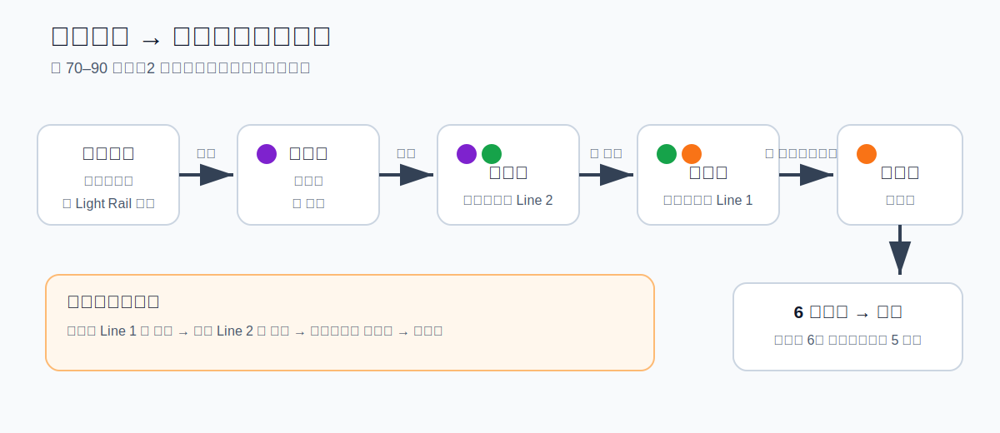
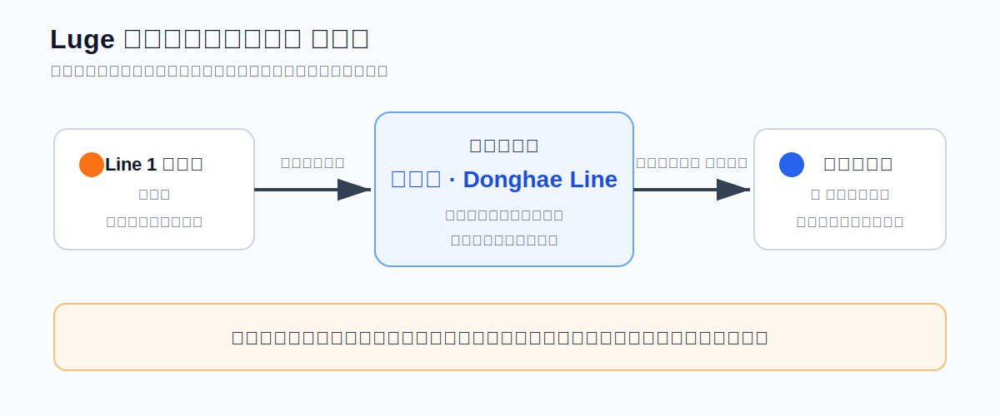
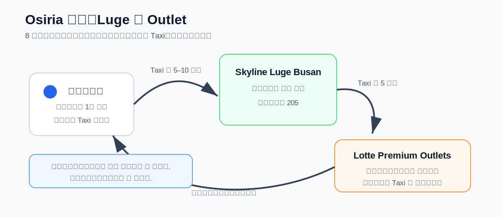
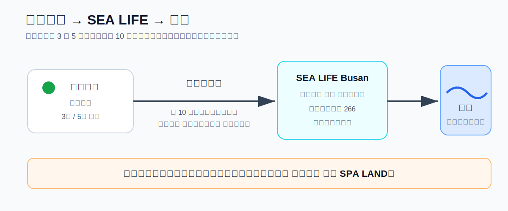
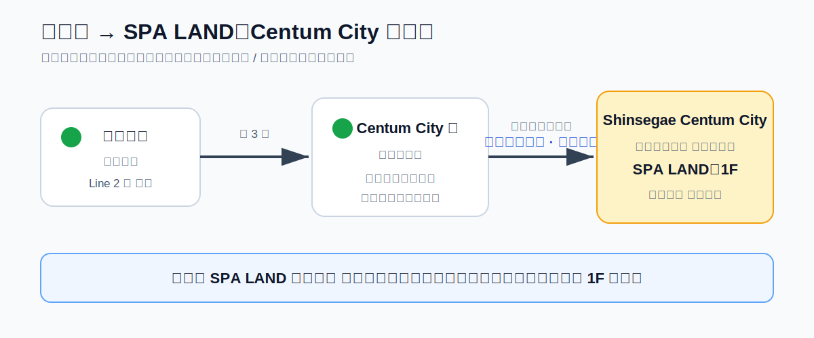
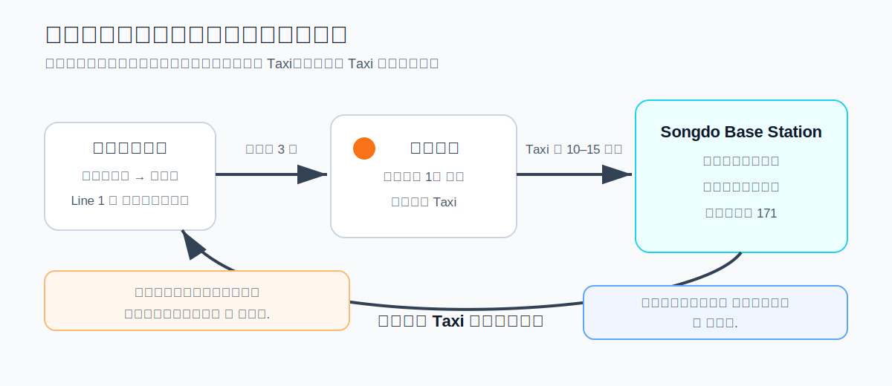

# 釜山交通筆記

> 原則：**少轉乘、少走路、看圖就能走**。下雨、炎熱、拿戰利品或已經累了，最後一段直接搭 Taxi。
>
> 路線確認：2026/07/23。本文圖片是簡化示意圖，不是比例尺地圖；公車班次、月台與出口施工仍以當天 **NAVER Map** 和現場標示為準。

## 旅程交通總覽

| 日期 | 主行程 | 預設交通 | 最容易走錯 |
|---|---|---|---|
| 7/31 | 金海機場 → 飯店 | 輕軌＋Line 2＋Line 1 | 沙上、西面轉乘方向 |
| 8/01 | Luge → Outlet | Line 1＋東海線＋短程 Taxi | 教大轉東海線 |
| 8/02 | 水族館 → 海邊 → SPA LAND | 地鐵＋步行 | 海雲台出口、Centum 地下連通 |
| 8/03 | 松島纜車 → 飯店 → 機場 | 地鐵＋Taxi＋固定軌道路線 | 回機場不要搭反 |

## 先記住 5 件事

1. 導航以 **NAVER Map（네이버 지도）**為主，景點直接貼韓文名稱搜尋。
2. 地鐵方向看「終點站韓文」，不要只看月台左右。
3. Mobile Visit Busan Pass **不能當交通卡**，另備 T-money／Cashbee。
4. 上公車刷卡，下車前按鈴並再次刷卡；即時班次以 NAVER Map 為準。
5. Taxi 可直接把本文中的韓文名稱與地址給司機看。

## 飯店資料

```text
Hound Hotel Busan Station
하운드호텔 부산역점
부산광역시 동구 중앙대로236번길 9
```

- **釜山站 6 號出口｜부산역 6번 출구**：步行約 5 分鐘。
- **草梁站 2 號出口｜초량역 2번 출구**：也是約 5 分鐘。
- NAVER Map 搜尋：`하운드호텔 부산역점`

---

# 7/31｜金海機場 → 飯店



## 走法

1. 國際航廈出關後，跟著 `경전철 / Light Rail / 공항역` 指標走到 **機場站 공항역**。
2. 輕軌往 **사상**，在 **沙上站 사상역**轉 Metro Line 2。
3. Line 2 往 **장산**，到 **西面站 서면역**轉 Line 1。
4. Line 1 往 **다대포해수욕장**，在 **釜山站 부산역**下車。
5. 從 **6 號出口**步行約 5 分鐘到飯店。

**預估時間：**約 70～90 分鐘，轉乘 2 次。

## 太累就直接 Taxi

```text
하운드호텔 부산역점으로 가 주세요.
부산광역시 동구 중앙대로236번길 9
```

---

# 8/01｜Skyline Luge → Outlet

## 飯店 → Osiria Station

```text
부산역 Line 1 往 노포
→ 교대역（教大站）
→ 依 동해선 / Donghae Line 標示走站內連通道
→ 東海線往 태화강／일광，確認停靠 오시리아
→ 오시리아역 1번 출구
```



### 為什麼改在教大轉乘？

教大站有連通道可轉東海線，比在釜田站出站後步行找另一個車站更直覺。只要一直找：

```text
동해선
Donghae Line
```

## Osiria → Luge → Outlet



1. **오시리아역 1번 출구**出站後搭短程 Taxi 到 Luge。
2. Luge 結束後搭 Taxi 到 Outlet。
3. Outlet 購物完直接搭 Taxi 回 **오시리아역**，不要拿著戰利品在高溫下硬走。
4. 回程搭東海線到 **교대역**，轉 Line 1 往 **다대포해수욕장**，在釜山站下車。

### 給司機看

```text
스카이라인 루지 부산으로 가 주세요.
부산광역시 기장군 기장읍 기장해안로 205
```

```text
롯데프리미엄아울렛 동부산점으로 가 주세요.
부산광역시 기장군 기장읍 기장해안로 147
```

```text
오시리아역으로 가 주세요.
```

---

# 8/02｜SEA LIFE → 海雲台 → SPA LAND

## 飯店 → SEA LIFE Busan Aquarium

```text
부산역 Line 1 往 노포
→ 서면역轉 Line 2
→ Line 2 往 장산
→ 해운대역下車
→ 3號或5號出口，往 해운대해수욕장 步行約10分鐘
```



- 水族館：**씨라이프 부산 아쿠아리움**
- 地址：**부산광역시 해운대구 해운대해변로 266**
- 水族館就在海灘旁，離場後直接看海，不需要再搭車。

### 少轉乘但可能塞車的備案

從釜山站附近搭 **1001 或 1003**，在 **해운대해수욕장**下車。只在 NAVER Map 顯示明顯更快時使用。

## 海雲台 → SPA LAND

```text
해운대역 Line 2 往 양산
→ 센텀시티역下車
→ 跟著 신세계백화점 / 스파랜드 標示走地下連通區
→ 新世界百貨 1F 的 SPA LAND
```



### 關鍵點

- 不要急著先走到戶外。
- 先找 **신세계백화점（新世界百貨）**，進百貨後再看 1F 導覽。
- SPA LAND 韓文：**스파랜드 센텀시티**。

## SPA LAND → 飯店

```text
센텀시티역 Line 2 往 양산
→ 서면역轉 Line 1
→ Line 1 往 다대포해수욕장
→ 부산역 6번 출구
```

---

# 8/03｜松島纜車 → 飯店 → 金海機場

## 飯店 → 松島海上纜車

出發日不研究公車班次，採用最穩定的 **地鐵＋短程 Taxi**。

```text
부산역 Line 1 往 다대포해수욕장
→ 자갈치역 1번 출구
→ Taxi 到 송도베이스테이션
```



### 給司機看

```text
송도해상케이블카 송도베이스테이션으로 가 주세요.
부산광역시 서구 송도해변로 171
```

## 松島 → 飯店取行李

玩完直接從 **송도베이스테이션**搭 Taxi 回飯店，不繞回公車站。

```text
하운드호텔 부산역점으로 가 주세요.
부산광역시 동구 중앙대로236번길 9
```

## 飯店 → 金海機場

BR163 於 19:10 起飛，建議 **15:15 前離開飯店**。

請把第一張圖反過來看：


```text
부산역 Line 1 往 노포
→ 서면역轉 Line 2
→ Line 2 往 양산
→ 사상역轉 부산김해경전철
→ 輕軌往 가야대
→ 공항역下車
→ 跟著 국제선청사 / International Terminal 指標
```

### 回機場不要搭反

- 釜山站 → 西面：看 **노포**。
- 西面 → 沙上：看 **양산**。
- 沙上 → 機場：輕軌看 **가야대**。

---

# 雨天與體力不足

- **Luge 日：**Osiria Station、Luge、Outlet 三段全部用 Taxi 接駁。
- **水族館＋SPA 日：**維持地鐵，不臨時增加海岸列車或廣安里。
- **松島日：**大雨或強風先確認纜車是否營運；取消時直接換室內備案。
- **迷路：**先把韓文名稱貼進 NAVER Map；仍找不到就把地址給站務員或司機看。

# 可直接使用的韓文

```text
이곳으로 가고 싶어요.
我想去這裡。

어디에서 갈아타요?
要在哪裡轉乘？

이 역에서 내려요?
是在這一站下車嗎？

택시 승강장이 어디예요?
計程車乘車處在哪裡？

하운드호텔 부산역점으로 가 주세요.
請載我去 Hound Hotel Busan Station。
```

# 官方資料

- 釜山市公共交通：https://www.busan.go.kr/eng/public-transportation
- 金海國際機場公共交通：https://www.airport.co.kr/gimhaeeng/cms/frCon/index.do?CONTENTS_NO=3&MENU_ID=110
- Busan Metro：https://www2.humetro.busan.kr/homepage/english/main.do
- Skyline Luge Busan 交通：https://busan.skylineluge.kr/en/visiting-us/getting-here/
- SEA LIFE Busan 交通：https://www.visitsealife.com/busan/en/plan-your-visit/before-you-visit/directions-parking/
- SPA LAND：https://www.shinsegae.com/store/entertainment/centum-spaland.do?storeCd=S
- 松島海上纜車交通：https://www.busanaircruise.co.kr/info/location
