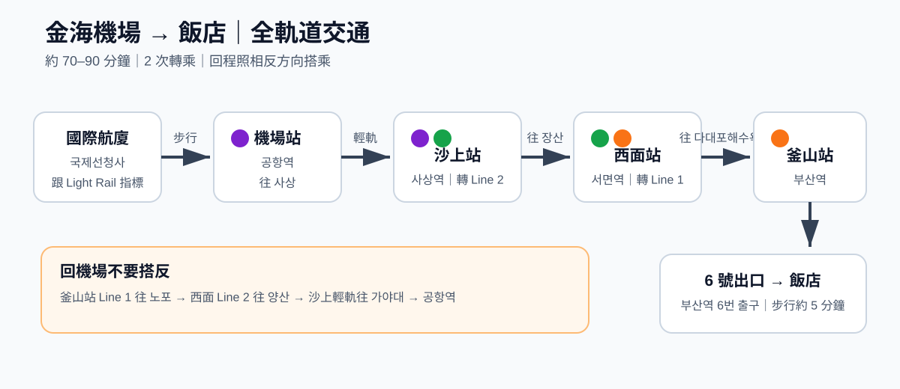
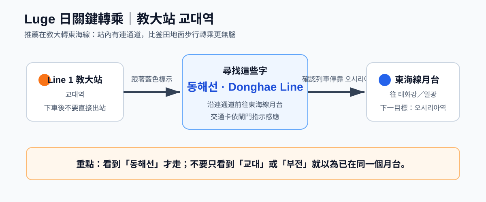
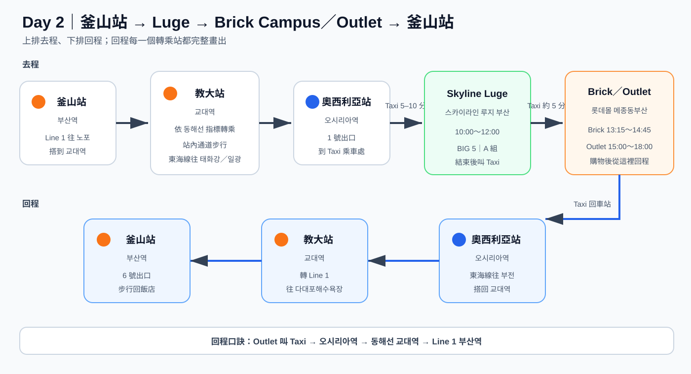
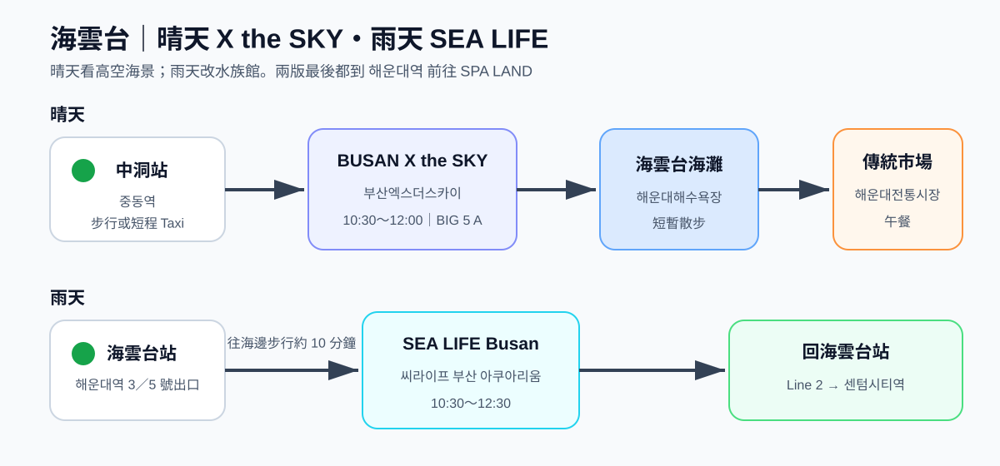
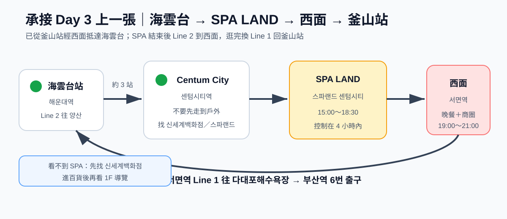
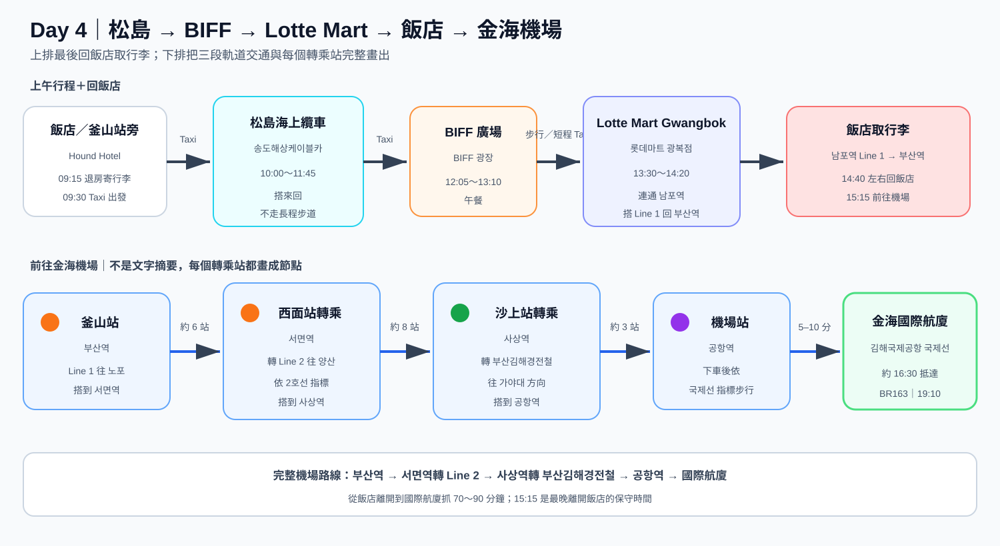

# 釜山交通筆記

> 原則：**少轉乘、少走路、看圖就能走**。下雨、炎熱、拿戰利品或已經累了，最後一段直接搭 Taxi。
>
> 路線確認：2026/07/29。圖片是簡化示意圖，不是比例尺地圖；班次、月台與出口施工仍以當天 NAVER Map 和現場標示為準。

## 交通總覽

| 日期 | 主行程 | 預設交通 | 硬規則 |
|---|---|---|---|
| 7/31 | 金海機場 → 飯店 | 輕軌＋Line 2＋Line 1 | 行李多或大雨可 Taxi |
| 8/01 | Luge → Brick Campus → Outlet | Line 1＋東海線＋短程 Taxi | Outlet 18:00 離開 |
| 8/02 | X the SKY → SPA → 西面 | Line 1＋Line 2 | 西面後 Line 1 回飯店 |
| 8/03 | 松島 → BIFF → Lotte Mart → 機場 | Taxi＋Line 1＋Line 2＋輕軌 | 14:20 離開樂天、15:15 離開飯店 |

## 先記住 6 件事

1. 導航以 NAVER Map（네이버 지도）為主，直接貼韓文名稱搜尋。
2. 地鐵方向看終點站韓文，不只看月台左右。
3. Mobile Visit Busan Pass 不能當交通卡，另備 T-money／Cashbee。
4. 上公車刷卡，下車前按鈴並再次刷卡。
5. 東海線班距可能較長，到站前先看即時班次。
6. Taxi 可直接把本文中的韓文名稱與地址給司機看。

## 飯店

```text
Hound Hotel Busan Station
하운드호텔 부산역점
부산광역시 동구 중앙대로236번길 9
```

- 釜山站 6 號出口（부산역 6번 출구）：步行約 5 分鐘。
- 草梁站 2 號出口（초량역 2번 출구）：步行約 5 分鐘。

---

# Day 1｜金海機場 → 飯店



```text
金海機場國際航廈
→ 跟著 경전철 / Light Rail 到 공항역
→ 輕軌往 사상
→ 사상역 轉 Line 2 往 장산
→ 서면역 轉 Line 1 往 다대포해수욕장
→ 부산역 6번 출구
→ 步行約 5 分鐘到飯店
```

預估約 70～90 分鐘。若交通卡買不到，可分段買單程票；之後再到正常營業的便利商店買兩張交通卡。

給 Taxi 司機看：

```text
하운드호텔 부산역점으로 가 주세요.
부산광역시 동구 중앙대로236번길 9
```

---

# Day 2｜Skyline Luge → Brick Campus → Outlet

## 飯店 → Osiria

```text
부산역 Line 1 往 노포
→ 교대역
→ 跟著 동해선 / Donghae Line 走站內連通道
→ 東海線往 태화강／일광，確認停靠 오시리아
→ 오시리아역 1번 출구
```



統一在教大站轉乘，不使用釜田站出站後再找另一個車站的版本。

## Osiria 區域



```text
오시리아역 1번 출구
→ Taxi 到 Skyline Luge
→ Taxi 到 Maison Dongbusan／Outlet
→ Brick Campus
→ Outlet
→ Taxi 回 오시리아역
```

Brick Campus 位於：

```text
브릭캠퍼스 부산
롯데몰 메종동부산 1층
부산광역시 기장군 기장읍 동부산관광로 8
```

給 Taxi 司機看：

```text
스카이라인 루지 부산으로 가 주세요.
부산광역시 기장군 기장읍 기장해안로 205
```

```text
롯데몰 메종동부산으로 가 주세요.
부산광역시 기장군 기장읍 동부산관광로 8
```

```text
오시리아역으로 가 주세요.
```

回程：

```text
오시리아역
→ 東海線到 교대역
→ Line 1 往 다대포해수욕장
→ 부산역 6번 출구
```

有戰利品時不要步行回車站。北港親水公園是回飯店、放完購物袋後才決定的選配。

---

# Day 3｜X the SKY → 海雲台 → SPA LAND → 西面

## 飯店 → BUSAN X the SKY



```text
부산역 Line 1 往 노포
→ 서면역 轉 Line 2 往 장산
→ 중동역下車
→ 步行或短程 Taxi 到 BUSAN X the SKY
```

```text
BUSAN X the SKY
부산엑스더스카이
부산광역시 해운대구 달맞이길 30
```

X the SKY 結束後：

```text
X the SKY
→ 海雲台海灘短暫散步
→ 海雲台傳統市場午餐
→ 해운대역
```

```text
海雲台傳統市場
해운대전통시장
부산광역시 해운대구 중동1로 42-16
```

## 雨天改 SEA LIFE

```text
해운대역 3번／5번 출구
→ 跟著 해운대해수욕장 方向步行約 10 分鐘
→ SEA LIFE Busan Aquarium
```

```text
씨라이프 부산 아쿠아리움
부산광역시 해운대구 해운대해변로 266
```

## 海雲台 → SPA LAND → 西面



```text
해운대역 Line 2 往 양산
→ 센텀시티역
→ 跟著 신세계백화점 / 스파랜드 地下標示
→ SPA LAND
```

SPA 結束後：

```text
센텀시티역 Line 2 往 양산
→ 서면역
→ 西面晚餐、地下街與商圈
→ 서면역 Line 1 往 다대포해수욕장
→ 부산역 6번 출구
```

西面主要出口：

- 1／2 號出口：主商圈、餐廳。
- 7 號出口：Lotte Department Store。
- 地下街可直接依現場 `서면지하도상가` 指標走。

---

# Day 4｜松島纜車 → BIFF → Lotte Mart → 機場



## 飯店 → 松島

出發日直接搭 Taxi，減少轉乘與等公車：

```text
송도해상케이블카 송도베이스테이션으로 가 주세요.
부산광역시 서구 송도해변로 171
```

## 松島 → BIFF 廣場

```text
송도베이스테이션
→ Taxi 到 BIFF 광장
→ 午餐
```

```text
BIFF 광장으로 가 주세요.
부산광역시 중구 비프광장로 36
```

## BIFF → Lotte Mart Gwangbok

```text
BIFF 廣場
→ 步行 15～20 分鐘
或 자갈치역 Line 1 一站到 남포역
或短程 Taxi
→ 롯데마트 광복점
```

八月炎熱或腳累時不要硬走。

```text
롯데마트 광복점
부산광역시 중구 중앙대로 2
남포역 10번 출구連通
```

## Lotte Mart → 飯店

```text
남포역 Line 1 往 노포
→ 부산역
→ 飯店取行李、整理戰利品
```

**14:20 必須離開 Lotte Mart。**

## 飯店 → 金海機場


```text
부산역 Line 1 往 노포
→ 서면역 轉 Line 2 往 양산
→ 사상역 轉 부산김해경전철
→ 輕軌往 가야대
→ 공항역
→ 跟著 국제선청사 / International Terminal
```

- 15:15 前離開飯店。
- 大眾交通抓 70～90 分鐘。
- 目標 16:30 左右抵達國際航廈。
- BR163 於 19:10 起飛。

---

# 雨天與體力不足

- Luge 日：Osiria、Luge、Maison Dongbusan、車站之間用 Taxi。
- 海雲台日：X the SKY 改 SEA LIFE，取消海灘散步。
- 松島日：大雨、雷雨、強風或停駛，直接改 Lotte Gwangbok 室內午餐＋採買。
- 迷路：先把韓文名稱貼進 NAVER Map；仍找不到就把地址給站務員或司機看。

# 可直接使用的韓文

```text
이곳으로 가고 싶어요.
我想去這裡。

어디에서 갈아타요?
要在哪裡轉乘？

이 역에서 내려요?
是在這一站下車嗎？

택시 승강장이 어디예요?
計程車乘車處在哪裡？

하운드호텔 부산역점으로 가 주세요.
請載我去 Hound Hotel Busan Station。
```

# 官方資料

- 釜山市公共交通：https://www.busan.go.kr/eng/public-transportation
- 金海國際機場公共交通：https://www.airport.co.kr/gimhaeeng/cms/frCon/index.do?CONTENTS_NO=3&MENU_ID=110
- Busan Metro：https://www2.humetro.busan.kr/homepage/english/main.do
- Skyline Luge Busan：https://busan.skylineluge.kr/en/visiting-us/getting-here/
- BUSAN X the SKY：https://www.visitbusan.net/en/index.do?lang_cd=en&menuCd=DOM_000000302008001000&uc_seq=996
- SEA LIFE Busan：https://www.visitsealife.com/busan/en/plan-your-visit/before-you-visit/directions-parking/
- SPA LAND：https://www.shinsegae.com/store/entertainment/centum-spaland.do?storeCd=S
- 松島海上纜車：https://www.busanaircruise.co.kr/info/location
